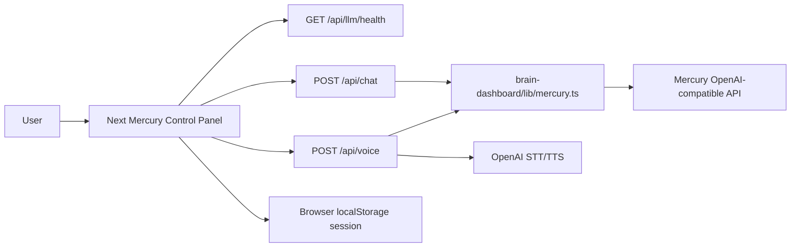

# Mercury Control Panel

The deployable Mercury surface now lives inside the Next.js app at:

- `brain-dashboard/app/mercury/page.tsx`
- `brain-dashboard/components/MercuryControlPanel.tsx`

The old standalone file remains useful as a no-build visual fallback:

- `packages/web-ui/example/standalone/index.html`

## What The Control Panel Does

- Sends chat prompts to `POST /api/chat`.
- Tests Mercury runtime health through `GET /api/llm/health`.
- Uploads voice samples to `POST /api/voice`.
- Stores local session state in browser storage.
- Supports backend-only, auto-fallback, and force-local modes.
- Exposes the tenant ID, task route, and runtime contract in the UI.

## Backend Routes

The deployable Next app owns these routes:

- `brain-dashboard/app/api/chat/route.ts`
- `brain-dashboard/app/api/voice/route.ts`
- `brain-dashboard/app/api/llm/health/route.ts`
- `brain-dashboard/lib/mercury.ts`

The Mercury adapter talks to OpenAI-compatible Mercury endpoints using `fetch`, so `brain-dashboard` does not need to import the package-level agent runtime.

## Required Runtime Variables

- `INCEPTION_API_KEY` or alias: Mercury chat and voice reasoning.
- `MERCURY_BASE_URL`: defaults to `https://api.inceptionlabs.ai/v1`.
- `MERCURY_MODEL`: defaults to `mercury-2`.
- `OPENAI_API_KEY`: voice transcription and TTS.

## Architecture

## Still Not Production-Complete

- Sessions are browser-local, not durable server records.
- Usage telemetry is not persisted to Supabase yet.
- There is no auth gate on `/mercury`.
- Production deploy still needs real Vercel env vars.

Bottom line: the missing app wrapper is now present. The next production step is server-side persistence and access control.
