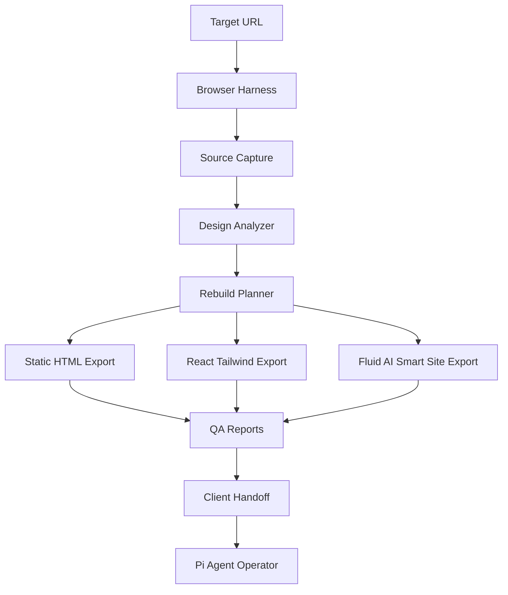
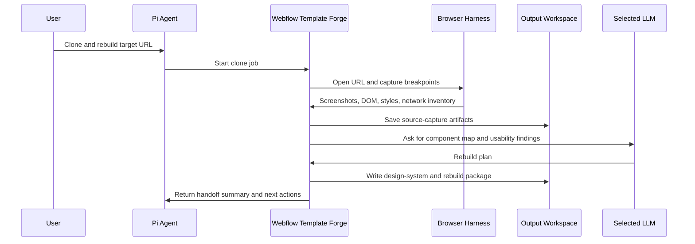

# Webflow Template Forge Architecture

## System Role

Webflow Template Forge is an isolated skill layer inside the Pi Agent repo. It should not mutate core Pi packages until the skill contract is stable.

The skill acts as a controlled bridge between:

- a public website or authorized Webflow source
- a browser capture system
- a design-token extractor
- a clean frontend rebuild engine
- a client handoff generator
- Pi Agent as the backend/control operator

## High-Level Data Flow

## Agent Control Loop

## Boundaries

### Pi Agent Owns

- prompt orchestration
- LLM selection
- approval gates
- execution logs
- browser session management
- handoff generation
- optional future Webflow API integration

### This Skill Owns

- capture contract
- extraction schema
- rebuild workflow
- smart-site placeholder rules
- QA checklist
- client handoff structure

### Client Frontend Owns

- static assets
- exported HTML/React
- public copy
- public media
- tracking placeholders

## No-Secret Rule

This skill must never commit credentials, API keys, cookies, exported `.env` values, or auth session data. Any production secret must be referenced by name only and injected at runtime.

## Future Extension Points

- Browser-use integration.
- Webflow Data API adapter.
- Webflow Designer Extension adapter.
- Onlook-style visual editing panel.
- Synthia clone adapter.
- Yappyverse character-site generator.
- GHL/Hexona lead-bridge generator.
